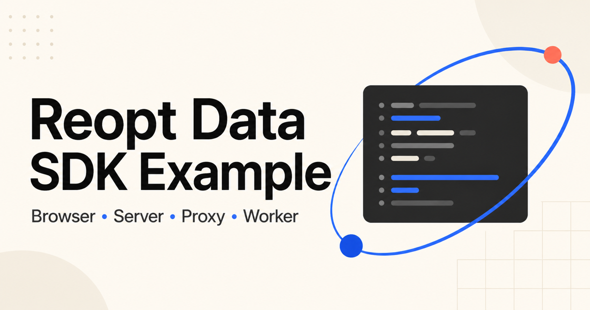
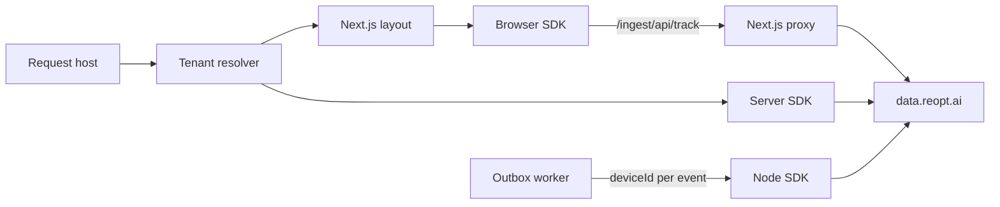

# Reopt Data SDK Example

A production-shaped Next.js reference application for
[`@reopt-ai/data-sdk-client`](https://www.npmjs.com/package/@reopt-ai/data-sdk-client)
and
[`@reopt-ai/data-sdk-server`](https://www.npmjs.com/package/@reopt-ai/data-sdk-server).




**Arc Supply** is the fictional workspace-goods storefront used by this
example. It provides a complete, responsive shopping journey while the
repository shows how an application connects browser, server, proxy, consent,
identity, and background-worker events to
[data.reopt.ai](https://data.reopt.ai) without hiding the integration behind a
demo-only abstraction. Its products, accounts, and orders are illustrative and
never represent real purchases.

The Arc Supply name, catalogue, logo, and product photography were created
solely for this example. They are not Reopt corporate brand assets and should
not be reused to represent Reopt or a real merchant.

## Why this repository exists

This repository serves two related purposes:

1. **Reference implementation.** Each supported SDK capability is exercised in
   a realistic Next.js App Router flow and mapped back to the relevant source.
2. **Compatibility testbed.** SDK releases and local SDK builds can be swapped
   without changing application code, then validated through real browser and
   ingest traffic.

The sample is intentionally opinionated about the boundaries that commonly
cause analytics integrations to fail:

- the browser write key is resolved per request, not compiled into the bundle;
- server credentials remain behind a `server-only` module boundary;
- the browser, Server Actions, Route Handlers, and workers converge on the same
  device identity;
- consent withdrawal removes identity instead of only suppressing events;
- analytics failures are fail-open and cannot break the storefront;
- end-to-end tests inspect the payload built by the SDK without mocking ingest.

## Architecture



The request host selects a project and its write key. `proxy.ts` seeds the
device cookie before rendering and provides a first-party `/ingest` endpoint.
Server-side events read the same identity from the request, while delayed events
carry the recorded `deviceId` explicitly.

## Quick start

### Prerequisites

- Node.js 22.22.1 or newer
- pnpm 10.30.1 (the repository pins it through `packageManager`)

With Corepack enabled:

```bash
corepack enable
pnpm install
pnpm dev
```

Open [http://localhost:4100](http://localhost:4100). No Reopt credentials are
required to explore the app: a missing write key creates a disabled, no-op SDK
client and the storefront continues to work. Local diagnostics show that
fail-open state explicitly.

### Connect a data.reopt.ai project

For a hosted or deployed environment, copy the example configuration and fill
in the credentials issued for your project:

```bash
cp .env.example .env.local
pnpm dev
```

The relevant variables are:

| Variable                    | Purpose                                            | Browser-visible |
| --------------------------- | -------------------------------------------------- | --------------- |
| `REOPT_BASE_URL`            | Origin of the Reopt data endpoint                  | Indirectly      |
| `REOPT_WRITE_KEY`           | Public project write key                           | Yes             |
| `REOPT_CLIENT_ID`           | Server API client identifier                       | No              |
| `REOPT_CLIENT_SECRET`       | Server API client secret                           | **Never**       |
| `BETTER_AUTH_SECRET`        | Session-signing secret for the example application | No              |
| `BETTER_AUTH_URL`           | Public origin of this application                  | Yes             |
| `REOPT_EXAMPLE_DIAGNOSTICS` | Opt-in production diagnostics                      | No              |

Do not add `NEXT_PUBLIC_` to the Reopt variables. The root layout resolves the
write key on the server and passes only the public value through the client
component boundary. This makes the single-tenant environment fallback behave
like the request-scoped multi-tenant implementation used by the example.

Production startup rejects a missing or short `BETTER_AUTH_SECRET`, a missing
`BETTER_AUTH_URL`, and a non-HTTPS public auth URL. Development uses a random,
process-local auth secret so the zero-configuration quick start remains useful.

### Connect a local reopt-data checkout

When developing the SDK and backend together, start `reopt-data` at
`http://localhost:4001`, then provision an isolated example project:

```bash
pnpm reopt:setup
pnpm dev
```

`pnpm reopt:setup` creates an organization, project, and API client through the
local development-only sign-in flow. It writes the resulting tenant mapping to
`.reopt-local.json`, which is ignored by Git.

Session assignment also requires the local ingest worker and an
`ENCRYPTION_KEY` in the reopt-data process. Events are still accepted when
either is missing, but the backend cannot issue session credentials.

## Explore the integration

Open the **SDK devtools** button in the lower-right corner before navigating.
It shows the exact outgoing batches and responses, queue depth, identity and
consent cookies, and this app's runtime configuration switches.

The panel is [`@reopt-ai/data-sdk-devtool`](https://github.com/reopt-ai/reopt-data/tree/main/packages/data-sdk-devtool).
On its own it is off under `NODE_ENV=production`; this app forces it on with
`createDevtools({ enabled: true })` (`lib/reopt/devtools.ts`) because showing
what the SDK sends is the point of the example. The switches are the app's own
tab, added through the panel's `panels` prop. A customer application keeps the
default.

The SDK mode footer still exposes deployment metadata and stays hidden in
production unless `REOPT_EXAMPLE_DIAGNOSTICS=true`; do not enable it in a
customer application.

| Route              | Integration exercised                                               |
| ------------------ | ------------------------------------------------------------------- |
| `/`                | Storefront and integration overview                                 |
| `/products`        | Query-string navigation and automatic page views                    |
| `/products/[slug]` | Manual page views, `register()`, path normalization, and `track()`  |
| `/cart`            | `cart.updated` and `cart.removed` browser events                    |
| `/checkout`        | Server Action and Route Handler conversion paths                    |
| `/orders`          | Recorded orders, device attribution, and the pending outbox         |
| `/account`         | `identify()` on sign-in and `reset()` on sign-out                   |
| `/lab`             | Exceptions, Web Vitals, queue controls, consent, and identity reset |
| `/guide`           | Live capability-to-source map and resolved SDK package versions     |

The devtools switches intentionally expose important edge cases:

| Switch                   | Result                                                             |
| ------------------------ | ------------------------------------------------------------------ |
| Automatic page views     | Removes `<ReoptPageView />`; product pages call `pageView()`       |
| Exception capture        | Enables `capture.exceptions`                                       |
| External consent manager | Uses `consent.persist: false` and lets the banner own the decision |
| Tracing headers          | Adds `reopt-device-id` to same-origin fetch/XHR                    |
| No bootstrap             | Relies only on identity seeded by the proxy                        |
| No write key             | Exercises the SDK's fail-open contract                             |
| Debug logging            | Enables `debug: true`                                              |

## Capability map

`lib/reopt/feature-map.ts` is the source of truth for the in-app `/guide` page.
When an SDK capability is added or removed, update that file and this summary in
the same change.

<!-- FEATURE-MAP:START — lib/reopt/feature-map.ts is the source of truth -->

| Area    | API                                                    | Reference                                                                           |
| ------- | ------------------------------------------------------ | ----------------------------------------------------------------------------------- |
| Browser | `<ReoptProvider config bootstrap>`                     | `app/layout.tsx` · `components/reopt/analytics-provider.tsx`                        |
| Browser | `<ReoptPageView />` / `pageView()`                     | `components/reopt/analytics-provider.tsx` · `components/reopt/manual-page-view.tsx` |
| Browser | `<ReoptWebVitals />`                                   | `components/reopt/web-vitals-table.tsx`                                             |
| Browser | `normalizePath`                                        | `lib/reopt/normalize-path.ts`                                                       |
| Browser | `init({ properties })` / `register()`                  | `components/reopt/manual-page-view.tsx`                                             |
| Browser | `track()`                                              | `components/shop/add-to-cart.tsx` · `components/shop/cart-lines.tsx`                |
| Browser | `identify()` / `reset()`                               | `components/shop/account-panel.tsx`                                                 |
| Browser | `getDeviceId()`                                        | `components/shop/checkout-form.tsx`                                                 |
| Browser | `capture.exceptions` / `captureException()`            | `components/reopt/instrumentation-lab.tsx`                                          |
| Browser | `consent.persist:false` / `setConsent()`               | `components/reopt/consent-banner.tsx` · `app/api/consent/route.ts`                  |
| Browser | `config.fetch`                                         | `lib/reopt/devtools.ts` · `components/reopt/devtools-drawer.tsx`                    |
| Browser | `flush()` / `pauseTracking()` / `resumeTracking()`     | `components/reopt/instrumentation-lab.tsx`                                          |
| Server  | `createReopt({ writeKey, credentials, getProfileId })` | `lib/reopt/server.ts`                                                               |
| Server  | `getBootstrap()`                                       | `app/layout.tsx`                                                                    |
| Server  | `getReopt().track()`                                   | `app/actions.ts` · `app/api/orders/route.ts`                                        |
| Server  | `createOnRequestError()`                               | `instrumentation.ts` · `app/api/boom/route.ts`                                      |
| Proxy   | `reoptProxy({ writeKey: resolver, proxy: true })`      | `proxy.ts`                                                                          |
| Node    | `createReoptNode()` + `identity.deviceId`              | `scripts/forward.ts` · `lib/shop/outbox.ts`                                         |
| Test    | `window.__reoptDevtools`                               | `e2e/*.spec.ts`                                                                     |

<!-- FEATURE-MAP:END -->

## Patterns worth copying

### Request-scoped tenant resolution

`lib/reopt/tenants.ts` maps the request host to a project. `proxy.ts` and
`lib/reopt/server.ts` share that resolver so the browser and server always use
the same write key. One module-scoped server SDK factory resolves both the write
key and credentials per request; the SDK keeps one batching engine per resolved
project and caches each resolver once per request.

`lib/reopt/tenants.ts` returns a minimal public tenant DTO. The separate
`lib/reopt/credentials.ts` module imports `server-only`, so a Client Component
cannot import server credentials without failing the build.

### Delayed conversions through an outbox

Checkout records who a conversion belongs to when the request is handled. The
Server Action uses only the identity verified from the request cookie; the
Route Handler verifies an explicit browser handoff against that same identity.
A separate process can then forward those rows later:

```bash
pnpm forward
```

Each event carries its own `identity.deviceId`, so one batch may contain events
for different visitors. Event-level identity takes precedence over a batch
header for server-authenticated requests.

### Transport-level end-to-end tests

The Playwright suite does not intercept `/api/track`. Instead, the application
injects a recording transport through `ReoptClientConfig.fetch`, stores the
payload the SDK actually constructed in `window.__reoptDevtools`, and still
sends the request to ingest. This distinguishes a valid payload from one that
only looked correct before the server rejected it.

## Security boundaries

This repository keeps the SDK fail-open while treating application security as
fail-closed:

- production runtime configuration is validated from
  `instrumentation.register()` before traffic is served;
- secrets are available only through `server-only` modules and minimal DTOs
  cross the Server Component boundary;
- every Server Action and Route Handler validates untrusted input with Zod;
- browser-provided identity must match the request-scoped SDK identity before a
  server-authenticated event can use it;
- orders and outbox rows are scoped to the current opaque, HTTP-only cart
  capability, preventing order IDs from becoming direct-object references;
- diagnostic payloads, tenant names, SDK paths, and ingest origins are hidden
  in production unless a controlled demo explicitly opts in;
- global response headers deny framing, MIME sniffing, unexpected browser
  capabilities, unsafe base URLs, and cross-origin form submission, and ask
  production browsers to remember HTTPS;

The commerce store remains intentionally in-memory. These boundaries make the
example safe to inspect and deploy as a controlled demo; they do not replace a
production database, rate limiting, durable authorization, or an organizational
privacy review.

## Develop against local SDK packages

Switch between published packages and a sibling `reopt-data` checkout:

```bash
pnpm sdk:mode
pnpm sdk:local
pnpm sdk:tarball
pnpm sdk:npm
```

Local and tarball modes manage explicit `pnpm-workspace.yaml` overrides instead
of hidden `pnpm link` state. The diff and lockfile therefore reveal exactly
which SDK is running. Local packages are consumed from `dist/`, so keep their
builds active:

```bash
pnpm --dir ../reopt-data \
  --filter @reopt-ai/data-sdk-client \
  --filter @reopt-ai/data-sdk-server dev
```

Set `REOPT_DATA_PATH` when the checkout is not at `../reopt-data`.

## Validation

```bash
pnpm check          # Prettier check, oxlint, and TypeScript
pnpm e2e            # Playwright against the development server
pnpm e2e:production # Playwright against a production build
```

The Playwright suite also protects the storefront quality bar: generated-image
loading, narrow-viewport overflow, keyboard access, and automated WCAG checks
on the primary public routes run beside the SDK and security contracts.

Set `SHOP_DEPLOYED_URL=https://...` and run `pnpm e2e:deployed` to exercise a
deployed instance. When `.reopt-local.json` is absent, tests that require a real
ingest round trip skip themselves; the fail-open contract still runs.

This repository intentionally does not use GitHub Actions. Contributors must
run the required checks locally and report the results in the pull request.

## Demo accounts

The example accounts live only in memory and are recreated after a server
restart:

- `sora@example.com` / `shop-demo-1234`
- `jiwon@example.com` / `shop-demo-1234`

Never use these credentials outside the example application.

## Project scope

This is an integration reference, not a production commerce starter. Product
data, accounts, carts, orders, and the outbox use in-memory or local development
storage so the SDK flows remain easy to inspect. Replace those pieces with your
own persistence, authentication, privacy, and operational controls.

The application uses Next.js 16 App Router, React 19, Tailwind CSS v4,
`@reopt-ai/opt-ui`, `@reopt-ai/opt-datagrid`, better-auth, oxlint, Prettier, and
Playwright.

See [CONTRIBUTING.md](./CONTRIBUTING.md) before proposing a change and
[SECURITY.md](./SECURITY.md) before reporting a vulnerability. Community
expectations are in [CODE_OF_CONDUCT.md](./CODE_OF_CONDUCT.md), and instructions
for coding agents live in [AGENTS.md](./AGENTS.md).
