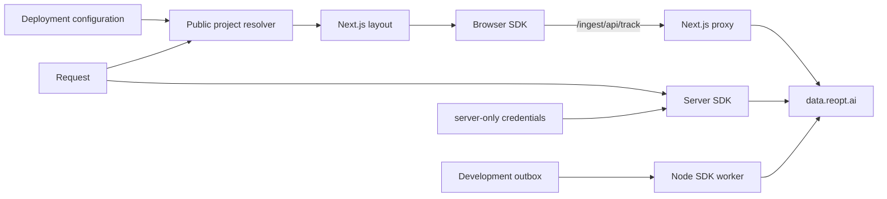

# reopt Data SDK Example

A public, production-shaped Next.js reference for
[`@reopt-ai/data-sdk-client`](https://www.npmjs.com/package/@reopt-ai/data-sdk-client)
and
[`@reopt-ai/data-sdk-server`](https://www.npmjs.com/package/@reopt-ai/data-sdk-server).
Use it alongside the [reopt Data documentation](https://data.reopt.ai/docs) to
see browser, server, proxy, consent, identity, and delayed-event patterns in a
complete application.


**Arc Supply** is a fictional workspace-goods store created for this example.
Its products, accounts, orders, brand, and imagery are illustrative; no purchase
is real and the assets must not be used to represent reopt or a real merchant.

## What this example demonstrates

- A public write key resolved on the server and passed through a narrow Client
  Component boundary.
- Server credentials isolated in a `server-only` module.
- A first-party `/ingest` proxy that shares browser and server identity.
- Consent withdrawal, identity reset, automatic events, Web Vitals, and error
  capture.
- Fail-open analytics: missing configuration and delivery failures do not break
  the storefront.
- Playwright assertions against payloads built by the real SDK transport.
- A development outbox worker that preserves per-event device identity.

## Quick start

Requirements: Node.js 22.22.1 or newer and pnpm 10.30.1.

```bash
corepack enable
pnpm install
pnpm dev
```

Open [http://localhost:4100](http://localhost:4100). Credentials are optional:
without a write key, the SDK becomes a no-op and the shop keeps working.

To connect a project:

```bash
cp .env.example .env.local
# Fill in values issued for your reopt Data project.
pnpm dev
```

| Variable                         | Purpose                                        | Requirement                         | Browser-visible |
| -------------------------------- | ---------------------------------------------- | ----------------------------------- | --------------- |
| `REOPT_DATA_BASE_URL`            | reopt Data endpoint                            | Defaults to `https://data.reopt.ai` | Indirectly      |
| `REOPT_DATA_WRITE_KEY`           | Public project write key                       | Optional; analytics fail open       | Yes             |
| `REOPT_DATA_CLIENT_ID`           | Server API client identifier                   | Optional, paired with secret        | No              |
| `REOPT_DATA_CLIENT_SECRET`       | Server API client secret                       | Optional, paired with client ID     | **Never**       |
| `REOPT_DATA_PROJECT_ID`          | Project used by round-trip verification        | Verification only                   | No              |
| `BETTER_AUTH_SECRET`             | Example session-signing secret                 | Production; at least 32 characters  | No              |
| `BETTER_AUTH_URL`                | Public origin of this application              | Production                          | Yes             |
| `REOPT_DATA_EXAMPLE_DIAGNOSTICS` | Enables diagnostic UI and routes in production | Optional; defaults to `false`       | No              |

Do not add `NEXT_PUBLIC_` to server credentials. Production startup rejects an
unsafe auth URL, an unsafe reopt Data URL, or an incomplete server credential
pair. HTTP service URLs are accepted only for localhost development.

### Develop against the sibling SDK

With `reopt-data` and this repository next to each other, run the complete local
loop from this repository:

```bash
pnpm dev:stack
```

It links the four Data SDK packages, performs an initial dependency-aware
build, keeps their `dist/` output watched, starts `reopt-data` with `dev:min`,
and starts this app. If `.reopt-local.json` exists, its first project is loaded
into the child-process environment without printing credential values. The
command does not create or reset Data resources and does not run a cron drainer.

Use `pnpm sdk:mode` to inspect the active source, `pnpm sdk:tarball` for a
package-fidelity check, and `pnpm sdk:npm` before handing off or deploying this
standalone repository.

## Architecture



`proxy.ts` seeds the browser-readable device cookie and exposes first-party
ingest. Server-side events resolve the same request identity. Delayed local
events record `deviceId` on each row so a worker batch can contain multiple
visitors safely.

## Explore the integration

Diagnostics are enabled automatically in development. The lazy SDK button,
payload and identity drawer, runtime switches, `/lab`, and `/api/boom` are all
absent from production unless the deployment explicitly sets
`REOPT_DATA_EXAMPLE_DIAGNOSTICS=true`. Enable that only for an isolated,
controlled example deployment because diagnostic payloads can contain visitor
event data.

| Route              | Integration exercised                                                |
| ------------------ | -------------------------------------------------------------------- |
| `/`                | Storefront and integration overview                                  |
| `/products`        | Query navigation and automatic page views                            |
| `/products/[slug]` | Manual page views, `register()`, normalization, and `track()`        |
| `/cart`            | Browser cart events                                                  |
| `/checkout`        | Server Action and Route Handler conversion paths                     |
| `/orders`          | Request-scoped orders and demo outbox rows                           |
| `/account`         | `identify()` on sign-in and `reset()` on sign-out                    |
| `/guide`           | Capability-to-source map and installed npm package versions          |
| `/lab`             | Diagnostics-only exceptions, Web Vitals, consent, and queue controls |

The diagnostics settings exercise automatic page-view ownership, exception
capture, an external consent manager, tracing headers, missing bootstrap,
missing write key, and debug logging.

## Capability map

[`lib/reopt/feature-map.ts`](./lib/reopt/feature-map.ts) is the source of truth
for the in-app `/guide` page. Update it and this table together whenever an SDK
capability changes.

<!-- FEATURE-MAP:START — lib/reopt/feature-map.ts is the source of truth -->

| Area    | API                                                    | Reference                                                                                                               |
| ------- | ------------------------------------------------------ | ----------------------------------------------------------------------------------------------------------------------- |
| Browser | `<ReoptProvider config bootstrap>`                     | `app/layout.tsx` · `components/reopt/analytics-provider.tsx`                                                            |
| Browser | `<ReoptPageView />` / `pageView()`                     | `components/reopt/analytics-provider.tsx` · `components/reopt/manual-page-view.tsx`                                     |
| Browser | `<ReoptWebVitals />`                                   | `components/reopt/analytics-provider.tsx` · `components/reopt/web-vitals-table.tsx`                                     |
| Browser | `normalizePath`                                        | `lib/reopt/normalize-path.ts`                                                                                           |
| Browser | `init({ properties })` / `register()`                  | `components/reopt/analytics-provider.tsx` · `components/reopt/manual-page-view.tsx`                                     |
| Browser | `track()`                                              | `components/shop/add-to-cart.tsx` · `components/shop/cart-lines.tsx`                                                    |
| Browser | `identify()` / `reset()`                               | `components/shop/account-panel.tsx`                                                                                     |
| Browser | `getDeviceId()`                                        | `components/shop/checkout-form.tsx`                                                                                     |
| Browser | `capture.exceptions` / `captureException()`            | `components/reopt/instrumentation-lab.tsx`                                                                              |
| Browser | `consent.persist:false` / `setConsent()`               | `components/reopt/consent-banner.tsx` · `app/api/consent/route.ts`                                                      |
| Browser | `config.fetch / config.observe`                        | `lib/reopt/devtools.ts` · `components/reopt/diagnostic-analytics-provider.tsx` · `components/reopt/devtools-drawer.tsx` |
| Browser | `flush()` / `pauseTracking()` / `resumeTracking()`     | `components/reopt/instrumentation-lab.tsx`                                                                              |
| Server  | `createReopt({ writeKey, credentials, getProfileId })` | `lib/reopt/server.ts`                                                                                                   |
| Server  | `getBootstrap()`                                       | `app/layout.tsx`                                                                                                        |
| Server  | `getReopt().track()`                                   | `app/actions.ts` · `app/api/orders/route.ts`                                                                            |
| Server  | `createOnRequestError()`                               | `instrumentation.ts` · `app/api/boom/route.ts`                                                                          |
| Proxy   | `reoptProxy({ writeKey: resolver, proxy: true })`      | `proxy.ts`                                                                                                              |
| Node    | `createReoptNode()` + `identity.deviceId`              | `scripts/forward.ts` · `lib/shop/outbox.ts`                                                                             |
| Test    | `window.__reoptDevtools`                               | `e2e/*.spec.ts`                                                                                                         |
| Test    | `ingest requestId → Query API requestId`               | `e2e/roundtrip.spec.ts` · `lib/reopt/scenarios.ts`                                                                      |

<!-- FEATURE-MAP:END -->

## Patterns worth copying

### Public project data and server secrets

[`lib/reopt/tenants.ts`](./lib/reopt/tenants.ts) is safe for `proxy.ts` because
it exposes only the public write key and endpoint. The separate
[`lib/reopt/credentials.ts`](./lib/reopt/credentials.ts) imports `server-only`.
Replace the public adapter with a host-aware project store if your application
serves multiple projects; keep credentials behind the same server boundary.

### Delayed events

Checkout records the request-verified identity with each demo outbox row.
During development, `pnpm forward` reads `.reopt-example/outbox.json` and sends
pending rows through `createReoptNode()`.

The file is a teaching aid, not a production queue. Production keeps demo rows
only in process memory so filesystem availability can never affect checkout.
Replace the demo outbox with a durable database or queue before adopting this
pattern in a real application.

### Transport-level tests

The diagnostic test suite injects the devtool recorder as
`ReoptClientConfig.fetch` and `ReoptClientConfig.observe`. It inspects the
sanitized payload and enqueue-time lifecycle produced by the SDK and still
allows the request to reach ingest; it does not make a stubbed request look
successful. The recorder and drawer live behind the diagnostic client boundary,
so the production default requests neither.

## Validation

```bash
pnpm check          # formatting, lint, types, current tree and Git history safety
pnpm e2e            # development server, fail-open and integration contracts
pnpm e2e:production # secure default plus explicit diagnostic production run
pnpm e2e:roundtrip  # optional browser → ingest → Query API verification
```

The round-trip suite requires `REOPT_DATA_WRITE_KEY`,
`REOPT_DATA_PROJECT_ID`, `REOPT_DATA_CLIENT_ID`, and
`REOPT_DATA_CLIENT_SECRET`; otherwise it skips. To validate an existing
deployment, set `SHOP_DEPLOYED_URL=https://...` and run `pnpm e2e:deployed`.

This repository intentionally does not use GitHub Actions. Contributors run the
required checks locally and report results in the pull request.

## Demo accounts and scope

- `sora@example.com` / `shop-demo-1234`
- `jiwon@example.com` / `shop-demo-1234`

The accounts and all commerce data are recreated after a process restart. This
is an SDK integration reference, not a commerce starter: replace its in-memory
authentication, carts, orders, and outbox with your own persistence,
authorization, privacy, rate limiting, and operational controls.

## Use with coding-agent skills

The [reopt-skills](https://github.com/reopt-ai/reopt-skills) repository ships
two agent skills for the Data SDK. They install into Claude Code, Codex, Cursor,
and other agents through the `skills` CLI and treat this repository as the
assembled reference app — the place to see multi-tenant resolution, the ingest
proxy, consent, identity, and the devtool working together in one Next.js app.

```bash
npx skills add reopt-ai/reopt-skills/data-sdk-install   # first install or upgrade
npx skills add reopt-ai/reopt-skills/data-sdk-review    # read-only integration audit
```

- **`data-sdk-install`** pins a `reopt/data-sdk-agent-rules` block into the
  consumer project's `AGENTS.md`, connects existing credentials (it never
  creates Data resources), wires the Next.js proxy / bootstrap / provider, and
  routes everything else to the installed package READMEs.
- **`data-sdk-review`** audits an existing integration for credential
  boundaries, proxy and bootstrap behavior, identity, consent, delivery, and
  production devtool exposure without editing code.

Both skills are version-gated against the SDK floor recorded in
[COMPATIBILITY.md](https://github.com/reopt-ai/reopt-skills/blob/main/COMPATIBILITY.md).
When the skills point you here, start from the [capability map](#capability-map)
and the [patterns worth copying](#patterns-worth-copying).

Read [CONTRIBUTING.md](./CONTRIBUTING.md) before proposing a change,
[SECURITY.md](./SECURITY.md) before reporting a vulnerability, and
[CODE_OF_CONDUCT.md](./CODE_OF_CONDUCT.md) for community expectations.

## License

This example is available under the [MIT License](./LICENSE).
